# 自监督学习论文

## SimCLR

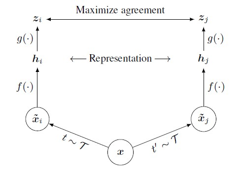

- 做法：strong data augmentation，projection head，negative sample，loss用InfoNCE

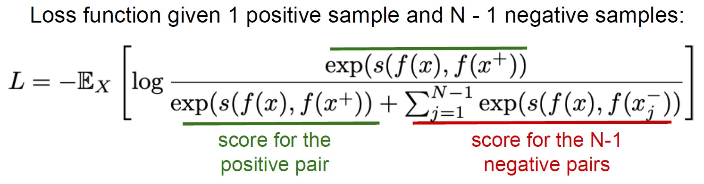

- 缺点：需要大的batch size才能达到好的效果（对GPU内存要求高）

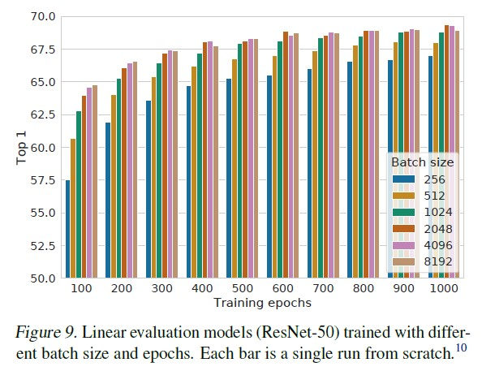

## MOCO v1

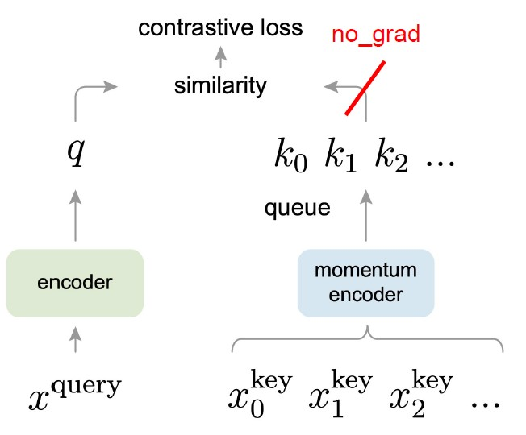

- 采用两个网络，只对query网络用梯度下降来更新，对另一个momentum encoder网络使用query网络的momentum来逐渐更新：$\theta_k = m\theta_k + (1-m)\theta_q$

- 维持一个running queue来当作负样本，这样做可以达到用小的batchsize来获取较多的负样本，并达到不错的效果

- Loss用InfoNCE

- 缺点是效果不如SimCLR好

## MOCO v2

- 延续MOCO v1使用momentum和running queue，这样使用较小的batchsize（256 vs 8196 SimCLR）就可以达到不错的效果

- 学习SimCLR， 使用projection head和strong data augmentation

## BYOL

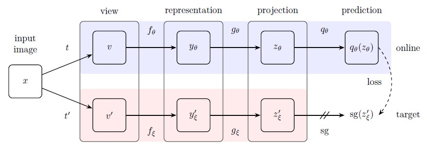

最大特点：去掉了negative samples

做法：

- 加入prediction head,给了online network很好的灵活性，online network的projection feature出来后不用完全match那个EMA模型,只需后面通过predictor来match
- loss为online网络的预测值与target网络的projection的MSE：
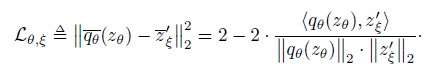
- 使用slow-moving average（momentum）来更新target网络
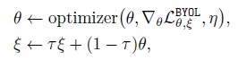

PS: v1 版本的ablation study说BN是必须的，否则精度很低，但是v2版本证明可以去掉BN

## SwAV

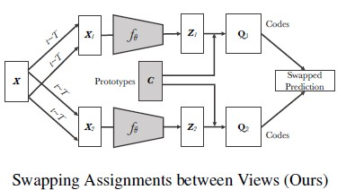

采用聚类算法，可以在线学习，因为不需要像其他算法那样对feature直接进行比较，只需要让同一张图片的不同view在同一个cluster就好。只对同一个batch里面的图片做聚类（batch够大时），对计算资源要求小，能够做到在线学习。可以支持大batch和小batch的训练。提出了新的data augmentation方法： multi-crop

- loss:

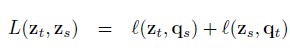

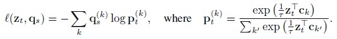

- compute codes

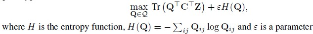

为了使得code能够均匀分布，对Q有以下限制：

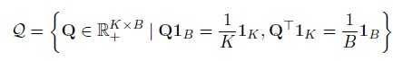

- Multi-crop

这是使用多种分辨率的图片来crop做数据增强，论文中使用正常分辨率的图片做两个crop，然后再使用低分辨率的图片做多次crop，这样增加了数据量，但因为是低分辨率的图片，只增加了少量计算量。

## SimSiam

特点：去掉了negative sample pairs， 不需要大batch， 不需要momentum encoders。只需要对其实一半做stop-grad来防止collapse

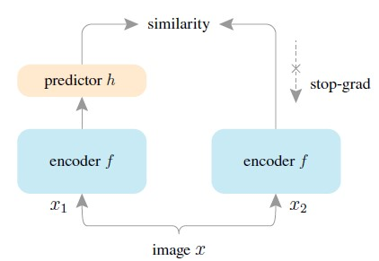

注意：与BYOL不同，simsiam这里两边的encoder是同一个网络

- Loss

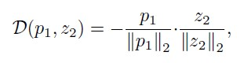

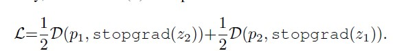

- 梯度更新

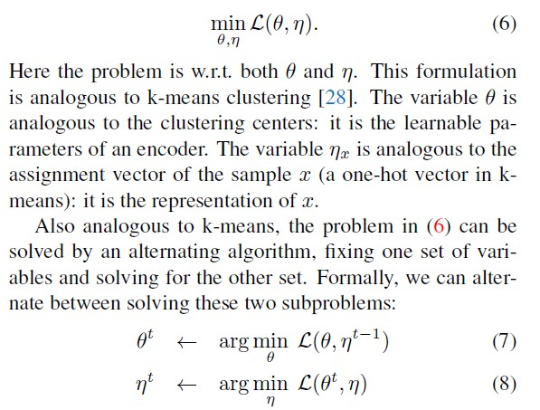

对这种更新方法的理解：

可以此方法类比为k-means聚类，把$\theta$当成每个聚类的中心，而$\eta$当成对每个sample的assignment vector，然后我们对这两个变量进行分布更新。

- 与其他网络对比

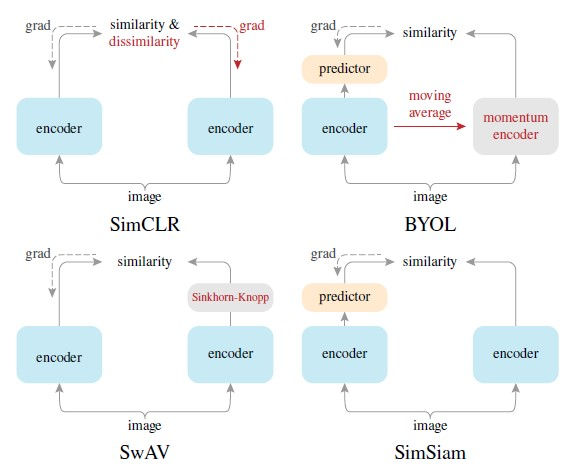

SimSiam相当于没有momentum encoder的BYOL，没有negative pairs的SimCLR和没有online clustering的SwAV。

## Barlow Twins

特点：网络结构简单，不需要large batches，asymmetry between the network twins such as a predictor network, gradient stopping, or a moving average on the weight updates. 目标方程是两个网络输出结果的相关矩阵cross-correlation matrix，目的是使这个相关矩阵尽可能接近与identity matrix

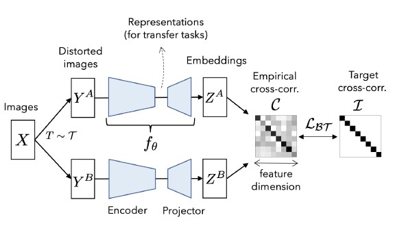

- Loss

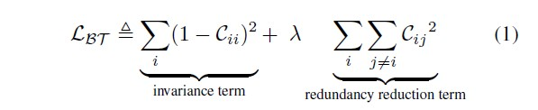

- 与其他网络对比

与SimCLR相比，受batch size和data augmentation的影响小，不过projector的dimension需要比较大。

## UP-DETR

给transformer做目标检测提供了一种新的pretext：random query patch detection

为保证分类任务的准确性，冻结了CNN backbone的网络，可以支持single和multi-query patch。

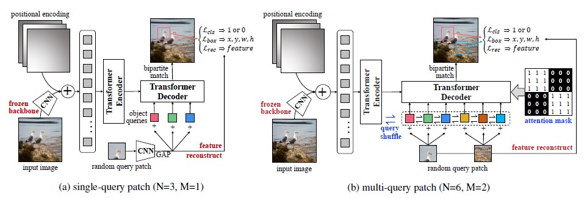

- Loss

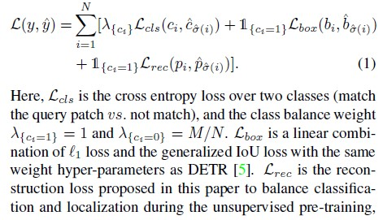

做multi-query时，为避免人为对patch进行分组的影响，需要对patch进行shuffle

## CLIP

特点：不需要专门的数据集，直接从网上爬取图片及其对应的文本描述来进行训练。能够在OCR, action recognition in videos, geo-localization, and many types of fine-grained object classification等领域达到较好的效果

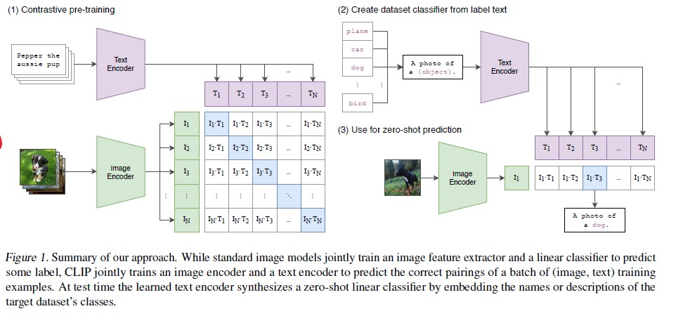

Loss 用的是InfoNCE，Batch size超级大，为32768

Text encoder 尝试了CBOW和Text Transformer。Image Encoder 用了ResNet 和 Vision Transformer。之后只使用linear projection来把两个encoder的输出投影到多模态embedding space。

## ViLD

主要思路是对基于分类的zero-shot模型，比如CLIP进行蒸馏，加入如Mask-RCNN之类的region detector,从而达到对检测任务的zero-shot

- 例子

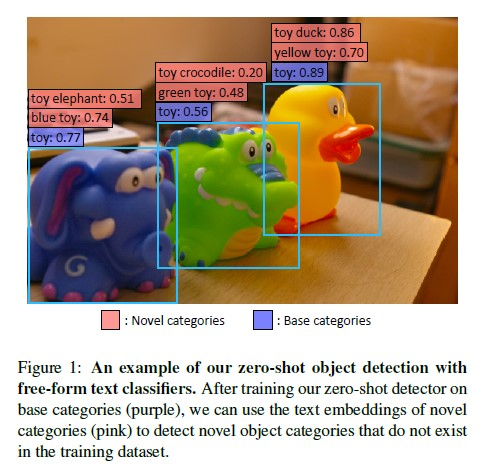

图中，紫色标签参与过训练，粉色标签是inference阶段新加入的。

- 流程

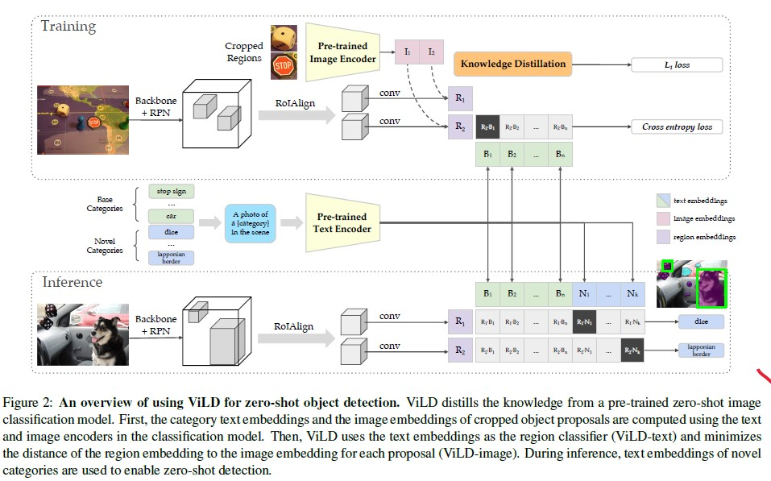

1. 训练阶段

先将图片标注区域的图片裁剪出来通过Pre-trained Image Encoder编码得到标注区域的image embeddings(红色部分)，同时通过Mask R-CNN(Backbone+RPN+RoIAlign支路)产生类别无关的region embeddings(紫色部分)，image embeddings和region embeddings需要进行知识蒸馏。基本类别(绿色部分)转化成文本送入Pre-trained Text Encoder产生text embeddings(绿色部分)，将region embeddings和text embeddings进行点积然后softmax归一化，监督信号是对应类别位置1，其余位置为0。

2. 推理阶段

将基本类别和新增类别转化成文本送入Pre-trained Text Encoder产生text embeddings(分别为绿色和蓝色部分)，同时通过Mask R-CNN产生类别无关的region embeddings，然后将region embeddings和text embeddings进行点积然后softmax归一化，新增类别(蓝色部分)取最大值的类别为该区域的预测结果。

- Loss

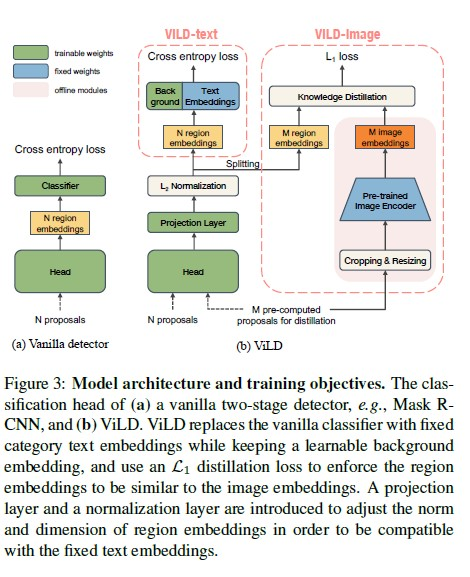

region 分类用CE；image和region的蒸馏用L1 loss