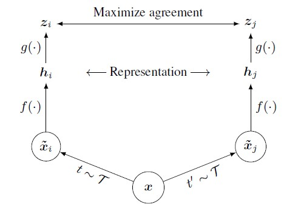
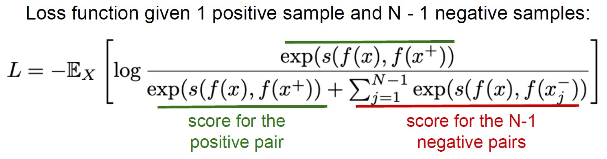
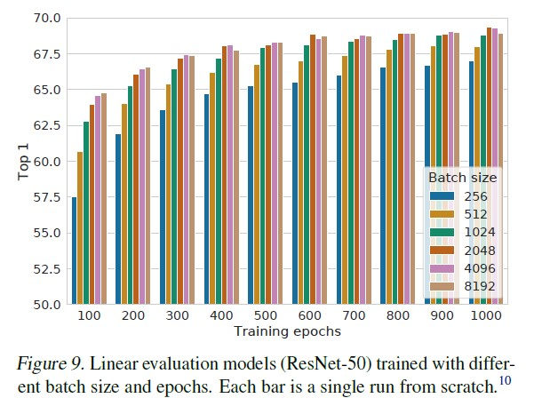
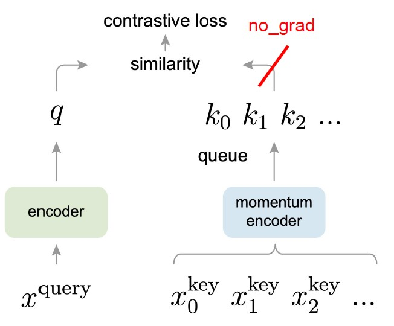

# 自监督学习论文

## SimCLR

- 做法：strong data augmentation，projection head，negative sample，loss用InfoNCE

- 缺点：需要大的batch size才能达到好的效果（对GPU内存要求高）

## MOCO v1

- 采用两个网络，只对query网络用梯度下降来更新，对另一个momentum encoder网络使用query网络的momentum来逐渐更新：$\theta_k = m\theta_k + (1-m)\theta_q$

- 维持一个running queue来当作负样本，这样做可以达到用小的batchsize来获取较多的负样本，并达到不错的效果

- Loss用InfoNCE

- 缺点是效果不如SimCLR好

## MOCO v2

- 延续MOCO v1使用momentum和running queue，这样使用较小的batchsize（256 vs 8196 SimCLR）就可以达到不错的效果

- 学习SimCLR， 使用projection head和strong data augmentation