# Vision and Language Pretraining

## UNITER

UNITER有两个Embedder，Image Embedder通过对Faster-RCNN的输出ROI feature以及其位置特征（7维，normalized top/left/bottom/right coordinates, width, height, and area.）进行融合建模，需要两个FC和一个LN操作完成。Text Embedder则参考BERT的输入，但是没有segment，因为一个图像只需要一段文本的描述。然后直接接入Transformer进行双向建模，融合两种模态，不同于双流预训练模型，这两类模态共享同一个Encoder

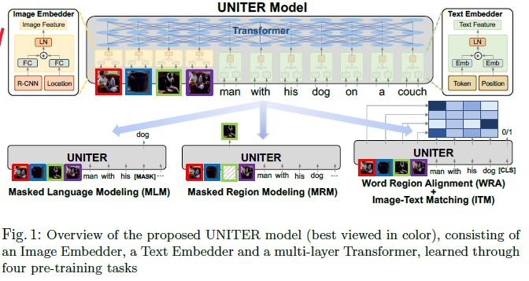

使用了四个pre-training tasks，对于mask来说，每次只mask一个模态，保留另一个模态完整。 
1. Masked Language Modeling (MLM)。随机掩盖某个输入单词，然后让模型预测该单词，loss用negative log-likelihood。
2. Masked Region Modeling (MRM, with three variants)
    - Masked Region Feature Regression (MRFR)，直接对掩盖的图片区域进行回归拟合，用L2 loss
    - Masked Region Classification (MRC)，判断掩盖图片区域的类别，loss用CE
    - Masked Region Classification with KL-Divergence (MRC-kl)，最小化KL散度
3. Image-Text Matching (ITM)。判断输入的文字和图片是否配对，loss用BCE
4. Word-Region Alignment (WRA)。文字和图像的对齐。loss为最小化他们的距离

## Oscar

使用object tags在共享空间中显式地将图像和句子耦合在一起，以对齐视觉和语言的语义

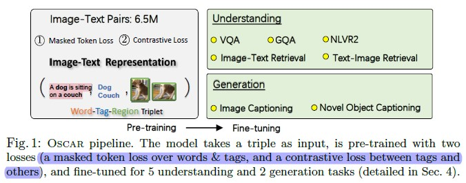

object tags来将图片和文本对齐，同时表明文字的embedding更有代表性，区分度

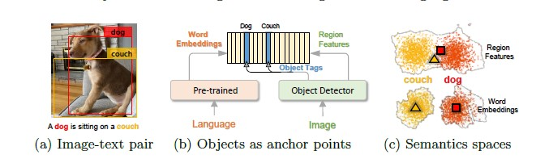

- Image region是通过Faster-RCNN来得到的，object tags也是通过同样的网络来检测

- 使用两种loss：
    1. Masked Token Loss (MTL)，随机mask文字或object tag，然后预测掩盖的部分
    2. Contrastive Loss。随机用其他图片的object tag替换当前图片的，然后预测图片和object tag是否匹配

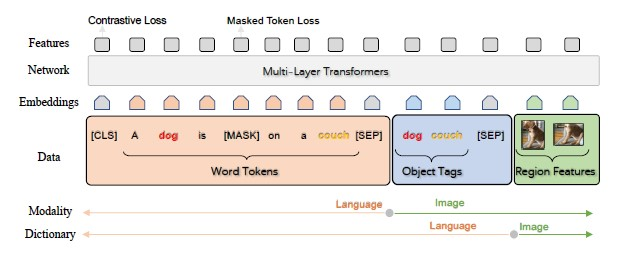

## Kaleido-BERT

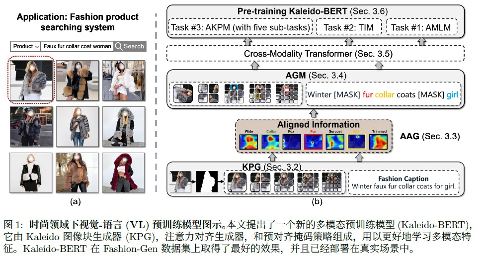

引入百变(Kaleido)策略生成不同尺度的图像特征，旨在帮助Transformer 更好地学习时尚领域的多模态表征。设计了预对齐掩码策略，它能进一步关注图像-文本对的语义关系。在此基础上，本文又针对不同尺度的图像块分别设计了五种自监督任务，分别为旋转(Rotation)、拼图(Jigsaw)、伪装(Camouflage)、着色(Grey-to-Color)、修复(Blank-to-Color)。

- KPG

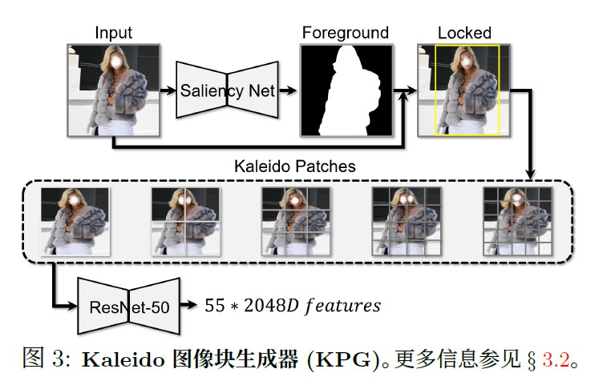

以一张商品图片作为输入，并将其送入Kaleido图像块生成器(KPG)。本文探索将单张图像切分不同的尺度(即，1×1, 2×2, . . . , 5×5)。最终，每一张图像被划分为55 块Kaleido 图像块。

- AAG

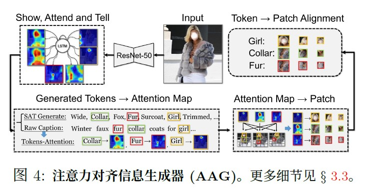

注意力对齐生成器(AAG) 目的是产生文本词例(token) 与Kaleido 图像块之间的模糊对齐。它作为文本生成器，自动描述图像的内容。在图像描述阶段，SAT 网络会对每一个词例生成注意力热图。以这些热图为依据可以推断生成的词与图像区域的关系。若生成的描述和原本描述有共现的单词，将依照共现单词的注意力热图来判断该单词倾向于与哪一Kaleido 图像块关联。从而得到一部分原始描述中的单词与Kaleido 图像块的对齐信息。

- 预训练任务

预对齐掩码语言模型(AMLM)、图文匹配任务(ITM) 以及提出的预对齐Kaleido 图像块模型(AKPM)

AMLM为随机mask单词，然后进行预测

ITM为判断图文是否匹配

AKPM为如图所示的五个任务：旋转(Rotation)、拼图(Jigsaw)、伪装(Camouflage)、着色(Grey-to-Color)、修复(Blank-to-Color)

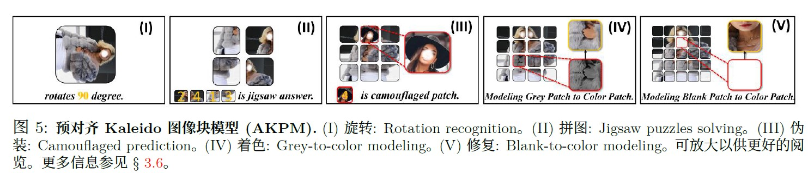

## UNIMO

特点：可以使用图片，文本和图文对来进行训练，并且训练的模型可以适用于单模态和多模态的任务。两种模态的数据信息可以互相促进，达到更好的效果。

- 例子 

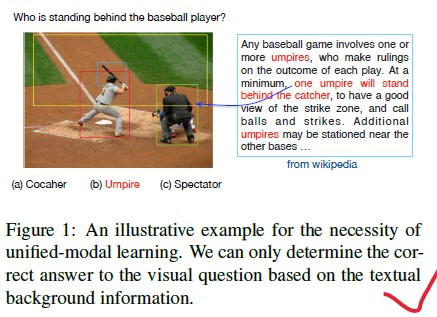

- 网络结构

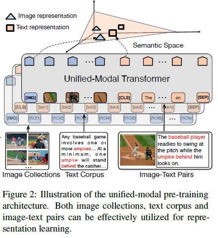

- Cross-Modal Contrastive Learning

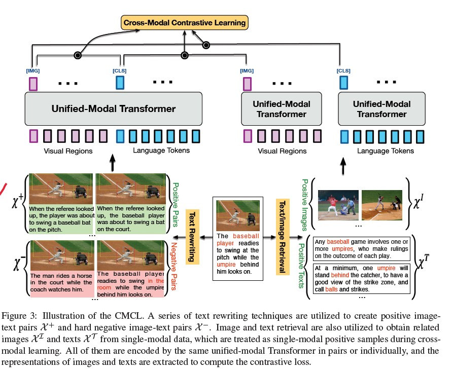

1. 文本改写（Text Rewriting）：为了增强图文在多个粒度上的语义对齐能力，论文将图像的文本描述从句子级、短语级和词汇级别三个粒度进行了改写。在句子级层面，基于回译（Back Translation，即一句话机器翻译模型翻译成多种其他语言，再翻译回来，利用机器翻译模型的能力在不改变句子原始意图的前提下得到相同含义的其他形式句子）的技术来获得一张图片的多个正例文本。进一步，利用自然语言离散化符号的特性，基于TF-IDF相似度检索得到更多的字面词汇重复率高，但是含义不同的句子作为一张图片的强负样本。在短语级和词汇级别，首先将文本解析成场景图，然后随机替换掉其中的物体（object）、属性（attribute）和关系（relation）以及它们的组合，获得这两个粒度的强负例。

2.  图像/文本检索（Image and Text Retrieval）：为了在跨模态学习中融合更多的单模态知识，图文对的信息会被从大规模单模态数据中检索出来的背景知识进一步增强和丰富。这部分检索的数据会分别和图文对中的另一种模态数据组成弱相关对儿加入对比学习。

- Loss

Loss由三个部分组成，一个是CMCL loss，一个是visual loss（主要是随机mask，然后预测），最后是language loss（也是随机mask再预测，不过为了让模型能同时支持生成和理解两类目标，UNIMO设计了双向预测（Bidirectional prediction）和 序列生成（Seq2Seq Generation）两种损失）

## ViLT

模型简单，速度快，很多数据集的精度比不过sota

- 4种VL模型比较

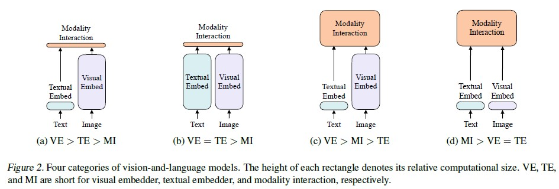

1. VSE、VSE++和SCAN属于(a)类型。对图像和文本独立使用encoder，图像的更重，文本的更轻，使用简单的点积或者浅层attention层来表示两种模态特征的相似性。

2. CLIP属于(b)类型。每个模态单独使用重的transformer encoder，使用池化后的图像特征点积计算特征相似性。

3. ViLBERT、UNTER和Pixel-BERT属于(c)类型。这些方法使用深层transformer进行交互作用，但是由于VE仍然使用重的卷积网络进行特征抽取，导致计算量依然很大。

4. 作者提出的ViLT属于(d)类型。ViLT是首个将VE设计的如TE一样轻量的方法，该方法的主要计算量都集中在模态交互上。

- Visual Embedding Schema

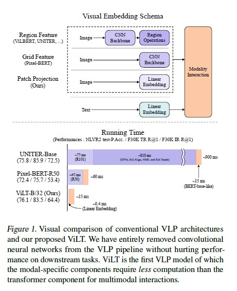

模态交互部分可以分成两种方式：一种是single-stream(如BERT和UNITER)，另一种是dual-stream(如ViLBERT和LXMERT)。其中single-stream是对图像和文本concate然后进行交互操作，而dual-stream是不对图像和文本concate然后进行交互操作。ViLT延用single-stream的交互方式，因为dual-stream会引入额外的计算量。

现有的VLP模型的text embedding基本上都使用类BERT结构，但是visual embedding存在着差异。在大多数情况下，visual embedding是现有VLP模型的瓶颈。visual embedding的方法总共有三大类，其中region feature方法通常采用Faster R-CNN二阶段检测器提取region的特征，grid feature方法直接使用CNN提取grid的特征，patch projection方法将输入图片切片投影提取特征。

这样不需要CNN，速度比其他模型快很多

- 模型

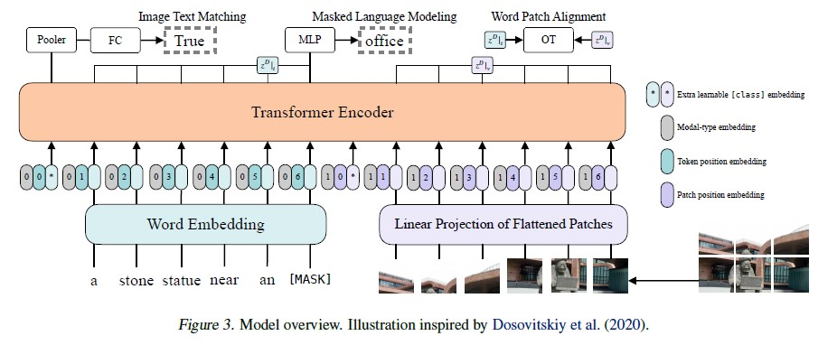

ViLT使用预训练的ViT来初始化交互的transformer，这样就可以直接处理视觉特征，不需要额外视觉encoder。

文本特征输入部分，将文本转化成word embedding，然后和position embedding进行相加，最后和modal-type embedding进行concate。

图像特征输入部分，将图像切块看成一个图像块序列，通过linear projection转化成visual embedding，然后和postion embedding进行相加，最后和modal-type embedding进行concate。

其中word embedding和visual embedding通过可学习的modal-type embedding标志位来区分，其中0标志位表示word embedding部分，1标志位表示visual embedding部分。

wrod embedding和visual embedding分别都嵌入了一个额外的可学习[class] embedding，方便和下游任务对接。

- 训练目标

1. Image Text Matching

2. Masked Language Modeling

3. Whole Word Masking

WWM是因为比如“giraffe”会被bert分为三个tokens ["gi", "##raf","##fe"]，如果没有把整个单词都mask掉，模型可能会不考虑图片信息，直接通过前后的tokens进行预测。

## VinVL

提出了一种新的目标检测模型，通过这个模型生成visual feature，然后输入到改进的Oscar模型里面，进行预训练，在多个VL数据集上达到很好的效果。

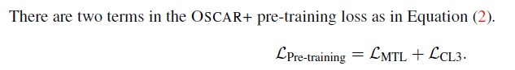

输入可以是{caption, image-tags, image-features}用于image captioning，也可以是{question, answer, image-features}用于VQA

第一个loss是Masked Token Loss，第二个是3-way Contrastive Loss，这是用来预测文字，图片和object tags是否配对，0表示匹配，1表示文字（question）不对，2表示tag（answer）不对

## VL-BERT

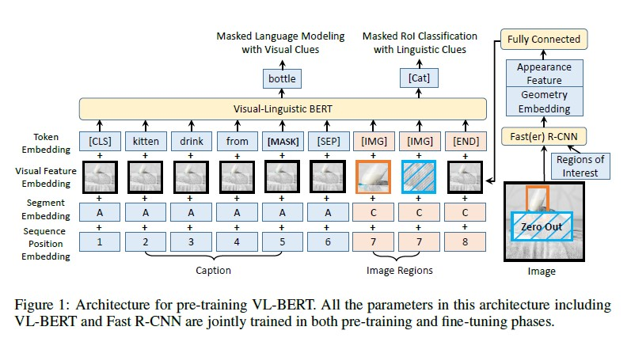

VL-BERT把视觉元素和语言元素都作为输入，模型分别在图像的感兴趣区域(RoIs)和输入句子中的单词上定义相应特征。

- Token Embedding

根据BERT的经验，语言词汇中嵌入了30000个单词。对每个特殊的元素分配特殊的Token。对于视觉元素，为每个元素分配一个特殊的[IMG]标记。

- Visual Feature Embedding

模型分别得到输入图像的视觉外观特征和视觉几何特征，然后将二者结合形成视觉特征。对于RoI所对应的视觉元素，采用Fast R-CNN进行特征表示。其中每个RoI输出层之前的特征向量作为视觉特征嵌入。对于非视觉元素，对应的视觉外观特征是对整个输入图像提取的特征。视觉几何特征的设计是为了通知VL-BERT图像中每个输入视觉元素的几何位置。视觉特征由视觉外观特征和视觉几何嵌入的串联得到，作为输入附在每个输入元素上。

- Segment Embedding

模型定义了三种类型的片段A、B、C，将输入元素从不同的来源中进行区分，即A和B分别表示第一个输入句子中的单词和第二个输入句子中的单词，而C表示输入图像中的RoI。

- Sequence Position Embedding

与BERT相同，向每个输入元素添加一个可学习的序列位置特征来表示输入序列中的顺序。由于输入的视觉元素之间没有自然的顺序，在输入序列中对它们进行任何排列都应该得到相同的结果，所以视觉元素的序列位置特征都是相同的。

Task 1: Masked Language Modeling with Visual Clues

Task 2: Masked RoI Classification with Linguistic Clues

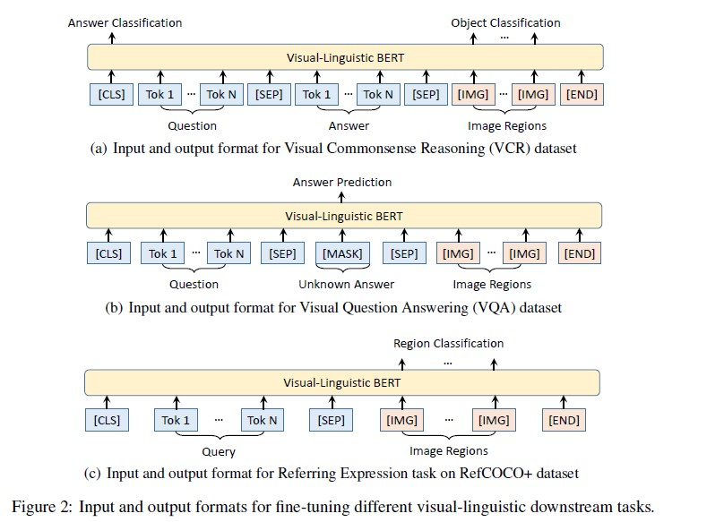

## Unicoder-VL

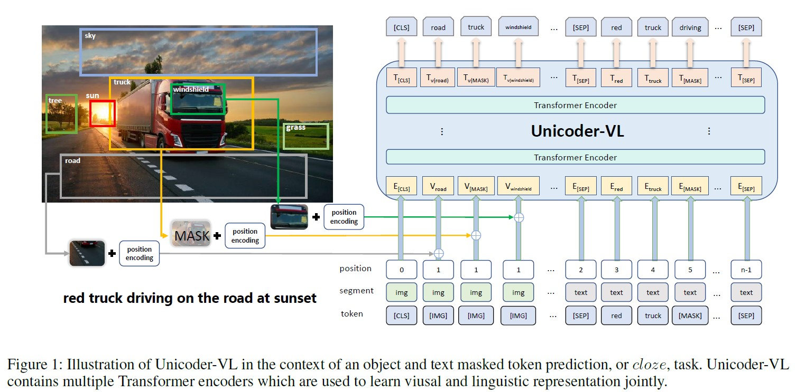

- Word embedding用BERT，Image embedding用Faster R-CNN，image那里的position encoding是一个5维的vector。

- 预训练task：Masked Language Modeling(MLM), Masked Object Classifation (MOC) and Visuallinguistic Matching (VLM).

- 在Image-Text Retrieva和Visual Commonsense Reasoning这两个task上面表现优秀

## TDEN

使用双流decouped网络结构，同时支持VL理解和生成任务。结果在Image Captioning，VQA，CIR，VCR表现SOTA

- Overview

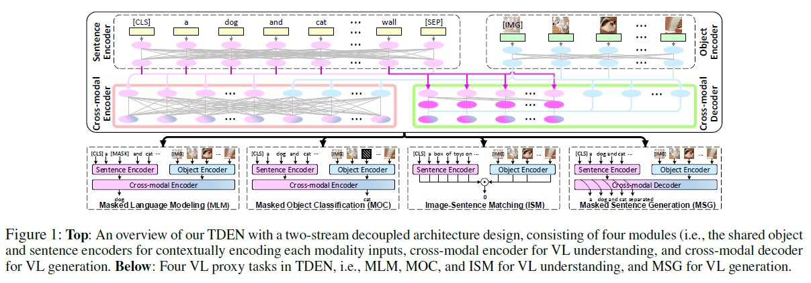

- 3种VLP结构对比

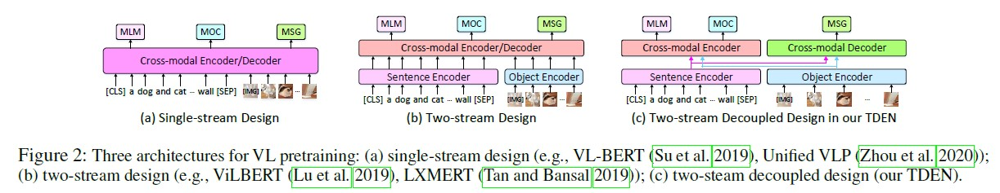

- Scheduled Sampling in VL Pretraining

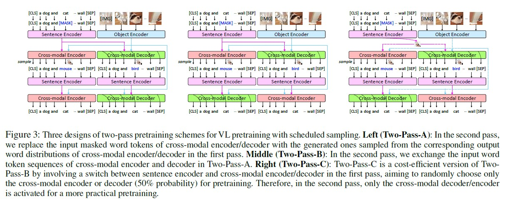

因为在下游任务的finetune时，并没有人工的mask，可能导致差异，所以作者采用这种方法
最后是用的Pass-C