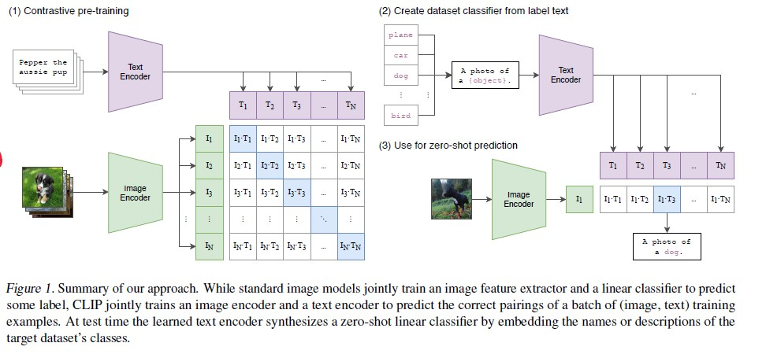

# Vision and Language Pretraining

## CLIP

特点：不需要专门的数据集，直接从网上爬取图片及其对应的文本描述来进行训练。能够在OCR, action recognition in videos, geo-localization, and many types of fine-grained object classification等领域达到较好的效果

Loss 用的是InfoNCE，Batch size超级大，为32768

Text encoder 尝试了CBOW和Text Transformer。Image Encoder 用了ResNet 和 Vision Transformer。之后只使用linear projection来把两个encoder的输出投影到多模态embedding space。

## UNITER

UNITER有两个Embedder，Image Embedder通过对Faster-RCNN的输出ROI feature以及其位置特征（7维，normalized top/left/bottom/right coordinates, width, height, and area.）进行融合建模，需要两个FC和一个LN操作完成。Text Embedder则参考BERT的输入，但是没有segment，因为一个图像只需要一段文本的描述。然后直接接入Transformer进行双向建模，融合两种模态，不同于双流预训练模型，这两类模态共享同一个Encoder

使用了四个pre-training tasks，对于mask来说，每次只mask一个模态，保留另一个模态完整。 
1. Masked Language Modeling (MLM)。随机掩盖某个输入单词，然后让模型预测该单词，loss用negative log-likelihood。
2. Masked Region Modeling (MRM, with three variants)
    - Masked Region Feature Regression (MRFR)，直接对掩盖的图片区域进行回归拟合，用L2 loss
    - Masked Region Classification (MRC)，判断掩盖图片区域的类别，loss用CE
    - Masked Region Classification with KL-Divergence (MRC-kl)，最小化KL散度
3. Image-Text Matching (ITM)。判断输入的文字和图片是否配对，loss用BCE
4. Word-Region Alignment (WRA)。文字和图像的对齐。loss为最小化他们的距离

## Oscar

使用object tags在共享空间中显式地将图像和句子耦合在一起，以对齐视觉和语言的语义

object tags来将图片和文本对齐，同时表明文字的embedding更有代表性，区分度

- Image region是通过Faster-RCNN来得到的，object tags也是通过同样的网络来检测

- 使用两种loss：
    1. Masked Token Loss (MTL)，随机mask文字或object tag，然后预测掩盖的部分
    2. Contrastive Loss。随机用其他图片的object tag替换当前图片的，然后预测图片和object tag是否匹配

## Kaleido-BERT

引入百变(Kaleido)策略生成不同尺度的图像特征，旨在帮助Transformer 更好地学习时尚领域的多模态表征。设计了预对齐掩码策略，它能进一步关注图像-文本对的语义关系。在此基础上，本文又针对不同尺度的图像块分别设计了五种自监督任务，分别为旋转(Rotation)、拼图(Jigsaw)、伪装(Camouflage)、着色(Grey-to-Color)、修复(Blank-to-Color)。

- KPG

以一张商品图片作为输入，并将其送入Kaleido图像块生成器(KPG)。本文探索将单张图像切分不同的尺度(即，1×1, 2×2, . . . , 5×5)。最终，每一张图像被划分为55 块Kaleido 图像块。

- AAG

注意力对齐生成器(AAG) 目的是产生文本词例(token) 与Kaleido 图像块之间的模糊对齐。它作为文本生成器，自动描述图像的内容。在图像描述阶段，SAT 网络会对每一个词例生成注意力热图。以这些热图为依据可以推断生成的词与图像区域的关系。若生成的描述和原本描述有共现的单词，将依照共现单词的注意力热图来判断该单词倾向于与哪一Kaleido 图像块关联。从而得到一部分原始描述中的单词与Kaleido 图像块的对齐信息。

- 预训练任务

预对齐掩码语言模型(AMLM)、图文匹配任务(ITM) 以及提出的预对齐Kaleido 图像块模型(AKPM)

AMLM为随机mask单词，然后进行预测

ITM为判断图文是否匹配

AKPM为如图所示的五个任务：旋转(Rotation)、拼图(Jigsaw)、伪装(Camouflage)、着色(Grey-to-Color)、修复(Blank-to-Color)

